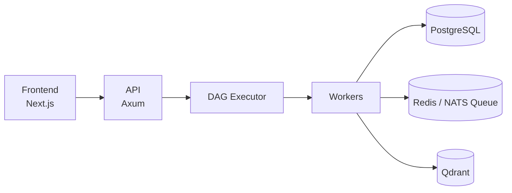

# legoOS — AI Operating System

> A self-hosted platform for building, running, and operating AI agents — visually, safely, and at scale.


## Overview

**legoOS** is a self-hosted platform for creating AI agents, building workflows visually, connecting
MCP servers and third-party apps, managing knowledge bases with RAG, giving agents long-term
memory, running local or cloud LLMs, scheduling jobs, monitoring executions, and collaborating in
teams. It's the control plane for agentic work: one place to design what an agent can do, watch it
run, and trust the result.

Think of it as sitting at the intersection of **ChatGPT** (conversational AI), **n8n** and
**Langflow** (visual workflow builders), **Zapier** (app integrations and automation), and
**OpenWebUI** (self-hosted model chat) — but built around agents as first-class citizens, with a
DAG execution engine, MCP-native tool connectivity, and production concerns like approval gates,
execution tracing, and cost tracking baked in from the start rather than bolted on.

It exists because most of today's tools solve one slice of this problem well: chat UIs don't
orchestrate multi-step workflows, workflow builders don't have first-class agent memory or RAG,
and automation platforms aren't built for the non-determinism of LLM-driven steps. legoOS is being
built to close that gap — self-hosted, inspectable, and owned by the people running it.

## Key Features

- **Agents** — define reusable AI agents with their own prompts, tools, and models
- **Visual workflow builder** — compose multi-step agent workflows as a DAG, no code required
- **MCP integrations** — connect MCP servers and third-party apps (GitHub, Slack, Gmail, Notion)
- **RAG knowledge bases** — upload documents and ground agents in your own data
- **Long-term memory** — agents recall context across sessions, not just within one run
- **Local & cloud models** — run open models locally or call cloud LLM providers, interchangeably
- **Scheduling** — trigger workflows on a cron schedule or external event
- **Execution monitoring** — live traces of every run, step by step
- **Evaluation & cost tracking** — measure agent quality and spend over time
- **Human-in-the-loop approval gates** — pause a workflow for human sign-off before risky steps
- **Team collaboration** — shared workspaces, roles, and permissions

## Tech Stack

| Layer    | Technologies |
|----------|--------------|
| Backend  | Rust, Axum, Tokio |
| Frontend | Next.js, React, Tailwind CSS, React Flow |
| AI       | MCP, RAG, Embeddings, Multi-agent orchestration |
| Data     | PostgreSQL, Redis, Qdrant |
| Infra    | Docker, Kubernetes, Terraform, Prometheus, Grafana, GitHub Actions |

## Architecture



See [docs/architecture.md](docs/architecture.md) for the full breakdown.

## Getting Started

### Prerequisites

- [Docker](https://www.docker.com/) and Docker Compose
- Rust (stable, 1.80+) — for local backend development
- Node.js 20+ — for local frontend development

### Clone & run

```bash
git clone https://github.com/Sane219/legoOS.git
cd legoOS
make setup
```

`make setup` creates local env files from their `.env.example` templates (only if they don't
already exist — safe to re-run), builds and starts the whole stack in the background, and waits
for the API to come up healthy. Once it's done:

- Frontend: http://localhost:3000
- API: http://localhost:8080

Run `make logs` to follow logs, `make down` to stop everything.

### Environment variables

Two `.env.example` templates exist: `apps/api/.env.example` (database URL, JWT secret, log level)
and `apps/web/.env.example` (the API URL the frontend calls). `make setup` copies both for you;
to configure by hand, copy `apps/api/.env.example` to `apps/api/.env` and
`apps/web/.env.example` to `apps/web/.env.local`. See [docs/dev-pipeline.md](docs/dev-pipeline.md)
for the full local dev workflow.

## Project Status

This is an actively developed **learning and portfolio project**, built in public, progressing in
phased steps. See [docs/roadmap.md](docs/roadmap.md) for the full build plan and current progress.

**Phase 1 (Foundation) is complete.** What's live today:

- JWT auth (register/login), workspaces, and membership
- A workflow data model (nodes/edges) and an in-process DAG executor (linear chains,
  conditional branching, fan-in) — see the `executor` crate
- A React Flow canvas to build, save, and run a workflow end to end
- `docker compose` for the full stack, with CI covering both the Rust backend and the
  Next.js frontend on every push

Redis, Qdrant, and the `worker` crate are provisioned/scaffolded but not yet wired up — they
land with Phase 2's async queue and RAG work.

## Documentation

- [docs/goal.md](docs/goal.md) — purpose, target users, and what "done" looks like at v1
- [docs/architecture.md](docs/architecture.md) — system architecture and data flow
- [docs/tech-stack.md](docs/tech-stack.md) — every technology chosen, and why
- [docs/roadmap.md](docs/roadmap.md) — phased build plan
- [docs/dev-pipeline.md](docs/dev-pipeline.md) — local dev workflow and CI
- [docs/decisions.md](docs/decisions.md) — architecture decision records (ADRs)

## Contributing

This is a personal project built in public. Issues, ideas, and discussion are welcome, but it's
primarily a solo learning effort — expect the roadmap and architecture to evolve as it's built.

## License

MIT — see [LICENSE](LICENSE) (placeholder, to be added).
