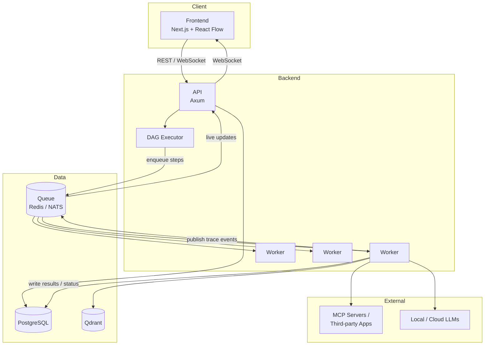

# Architecture

## Overview

legoOS is split into four layers: a **frontend** for designing and observing workflows, an **API**
for auth, CRUD, and orchestration requests, a **DAG executor** that turns a workflow definition
into a running execution, and a pool of **workers** that actually perform each step (calling an
LLM, calling an MCP tool, querying a vector store, etc.). State and coordination live in
PostgreSQL, a message queue, and a vector database.

## Components

### Frontend (Next.js + React)

The visual workflow builder, built on React Flow. Users compose agent nodes, MCP tool-call nodes,
conditional branches, and approval gates into a DAG. The frontend also renders the live execution
trace (via WebSocket) and past-execution history, plus team/workspace management screens.

### API (Axum)

The single entry point for the frontend. Handles authentication, workspace/team management, CRUD
for agents/workflows/knowledge bases, and accepts "run this workflow" requests. It does not
execute workflow steps itself — it hands off to the DAG executor and queue, then streams status
back to the frontend over WebSocket as workers report progress.

### DAG Executor

Takes a workflow definition (a directed acyclic graph of nodes and edges) and a trigger (manual
run, schedule, webhook) and turns it into a concrete **execution**: a run record plus one task per
node, respecting dependency order. The executor:

- Resolves node dependencies and determines which nodes are ready to run
- Enqueues ready nodes as tasks onto the queue
- Tracks per-node state (pending, running, succeeded, failed, waiting-for-approval)
- Propagates outputs from upstream nodes as inputs to downstream nodes
- Handles branching (conditional edges) and fan-out/fan-in
- Pauses execution at approval-gate nodes until a human responds, then resumes the downstream
  portion of the graph exactly as if the gate were a normal completed node
- Marks the overall execution complete/failed once all reachable nodes have terminated

The executor itself is stateless per request — all execution state lives in Postgres, so it can be
restarted or scaled horizontally without losing in-flight workflows.

### Workers

Stateless processes that pull tasks off the queue and execute a single node: calling an LLM
provider, invoking an MCP tool, querying the vector DB for RAG context, reading/writing agent
memory, or evaluating a condition. Each worker reports its result (output, status, cost, trace
events) back to Postgres and publishes a trace event onto the queue so the API can push a live
update to any connected frontend. Workers are horizontally scalable and node-type-agnostic — any
worker can pick up any task type.

### Queue (Redis / NATS)

Decouples the executor (which decides *what* should run next) from the workers (which *run* it).
Used for both task dispatch (executor → workers) and trace event fan-out (workers → API →
frontend). Redis is the starting point for simplicity; NATS is the planned upgrade path once
throughput or multi-node delivery guarantees demand it (see [decisions.md](decisions.md) and
[roadmap.md](roadmap.md) Phase 4).

### PostgreSQL

System of record for everything durable: users, workspaces, teams, permissions, agent
definitions, workflow definitions, execution/task state, trace history, evaluation results, and
cost records. If it needs to survive a restart or be queried later, it's in Postgres.

### Qdrant (Vector DB)

Stores document embeddings for RAG knowledge bases and, later, embedded memory entries for
long-term agent memory. Queried by workers at retrieval time to fetch context relevant to the
current step.

## How MCP Integration Fits In

MCP (Model Context Protocol) servers are treated as first-class tool providers. An MCP connection
is configured once per workspace (credentials, endpoint), and any agent node in any workflow can
declare which MCP tools it's allowed to call. At execution time, the worker running that node
opens (or reuses) an MCP client session, calls the requested tool with the LLM-produced arguments,
and feeds the result back into the agent's context. This means adding support for a new
third-party app (GitHub, Slack, Gmail, Notion, ...) is a matter of configuring or building an MCP
server for it — the executor and worker logic doesn't need to change per integration.

## How the Queue/Worker Model Works

1. The DAG executor determines a node is ready to run (all its dependencies have succeeded) and
   enqueues a task message containing the node's config and resolved inputs.
2. A worker picks up the task, executes it, and writes the result and status to Postgres.
3. The worker publishes a trace event (started/progress/completed/failed) to the queue.
4. The API subscribes to trace events for executions with an active frontend connection and
   forwards them over WebSocket, giving the live trace UI its real-time feel.
5. The executor is notified (via the same queue or a Postgres poll/listen) that the node
   completed, re-evaluates the graph, and enqueues the next batch of ready nodes.

This separation means the executor never blocks on slow work (an LLM call, a slow MCP tool) — it
only ever does graph bookkeeping, and workers scale independently to absorb load.
